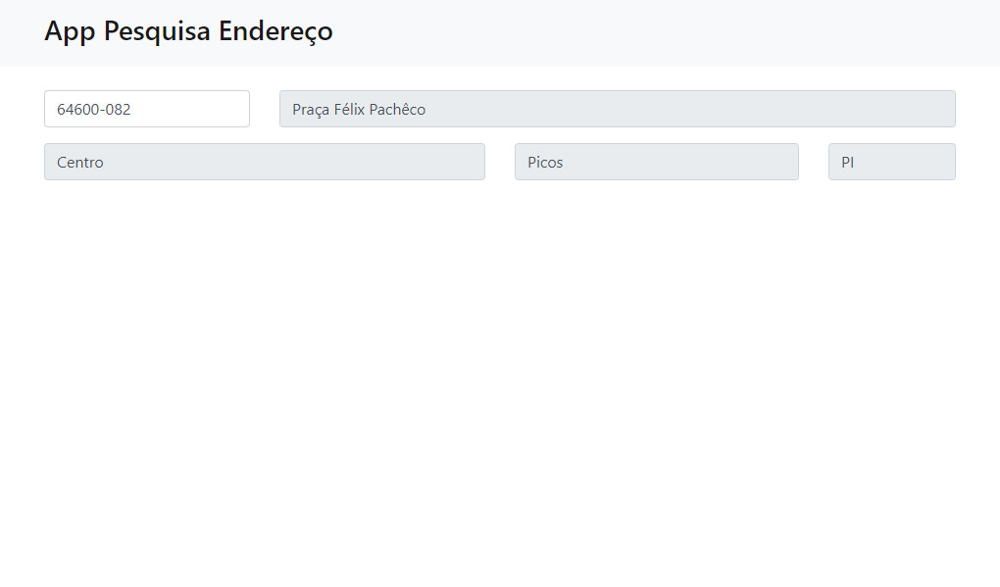

# AddressLookup
Bem-vindo ao AddressLookup, projeto web que permite inserir um CEP e obter informações detalhadas sobre o endereço correspondente utilizando a API ViaCEP. Com HTML, CSS, Bootstrap, JavaScript e AJAX.Esta aplicação proporciona uma forma fácil e rápida de obter dados de endereços.

## Visão Geral

O AddressLookup é uma aplicação web intuitiva que utiliza a API ViaCEP para fornecer informações detalhadas sobre um endereço a partir do CEP inserido. A interface simples e responsiva torna a consulta de endereços rápida e eficiente.

## Tecnologias Utilizadas

- **HTML5**: Estruturação da interface do usuário.
- **CSS3 e Bootstrap**: Estilização para uma experiência visual atraente.
- **JavaScript e AJAX**: Requisições assíncronas para a API ViaCEP.

## Recursos

- Formulário para inserção do CEP.
- Exibição dinâmica de informações como endereço, bairro, cidade e UF.
- Integração com a API ViaCEP para obter dados precisos.

## Como Usar

1. Faça o download ou clone o repositório.
2. Abra o arquivo `index.html` em seu navegador.
3. Insira o CEP desejado no formulário.
4. Aguarde a exibição das informações do endereço.

## Contribuições

1. Faça um fork do repositório.
2. Clone o fork para a sua máquina local.
3. Faça suas modificações e adições.
4. Envie um pull request para revisão.

## Estrutura do Projeto

- `index.html`: Página principal do aplicativo.
- `css/`: Estilos em CSS.
- `js/`: Código JavaScript e AJAX.
- `img/`: Imagens aplicação.

## Agradecimentos

Obrigado por contribuir com o AddressLookup! Esperamos que esta ferramenta torne a busca de endereços mais fácil e rápida. Relate problemas, sugira melhorias ou contribua com código para aprimorar ainda mais o aplicativo.

Esperamos que o AddressLookup facilite a obtenção de informações de endereço via CEP!

